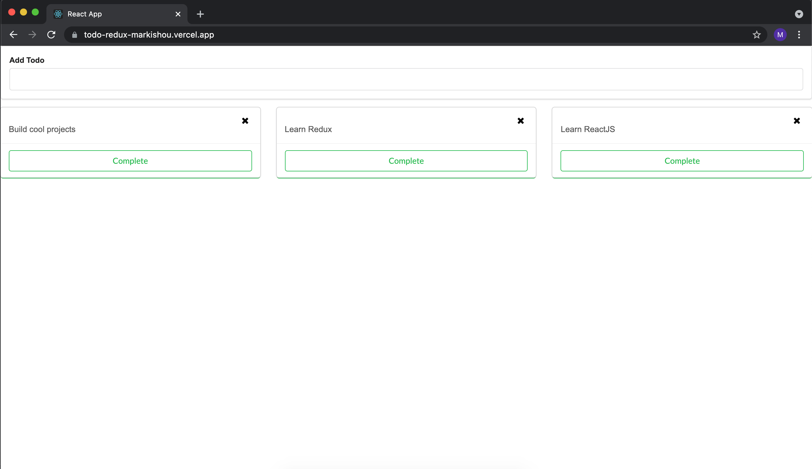

# Simple Todo App

Hello World! This is one of the first applications I made from scratch on the journey to become a frontend eng/dev. I hope you enjoy!

## Description

This is a simple todo app that allows you to add, mark as complete, and remove todos. You can check out this app by cloning the repo or accessing the link below!

- https://todo-redux-markishou.vercel.app/

## Languages used

- JavaScript
    - The form, todo list, and todo components were buit using the popular JS library, ReactJS. In addition, the state used by the components are managed by the Redux library. Although Redux was not needed for an app of this size, I felt that it was good practice for learning the library in case I want to implement it in future projects that are more complex.
    - As a side note, I also created the same app only using ReactJS which I will include in another repo!
- HTML & CSS
    - I have to admit, I am still learning CSS so, much of the styling for this app came from the Semantic UI framework. However, there is still some styling I've created for some of the components!

## Future todos (get it?)

- As I learn more CSS, I will implement my own styling instead of using outside frameworks.
- In the future, I want to implement firebase so that the todos and be stored and accessed from a personal account.

